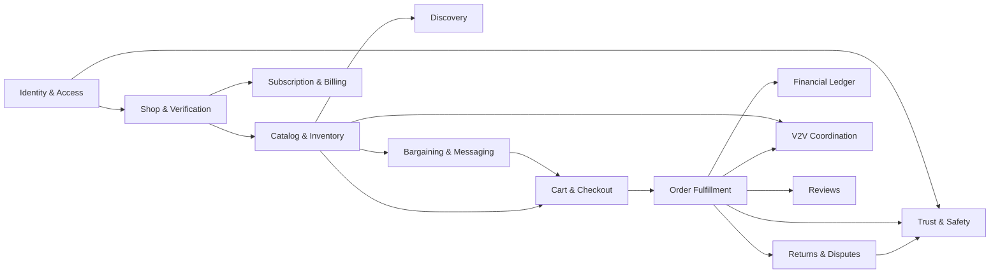
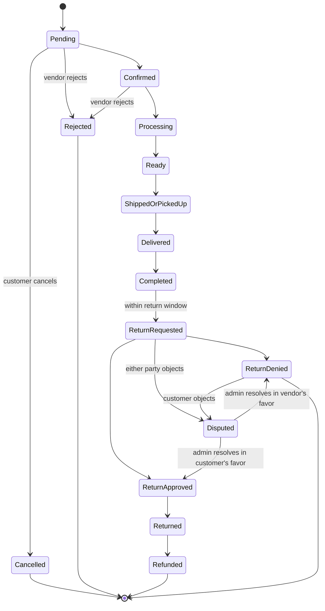
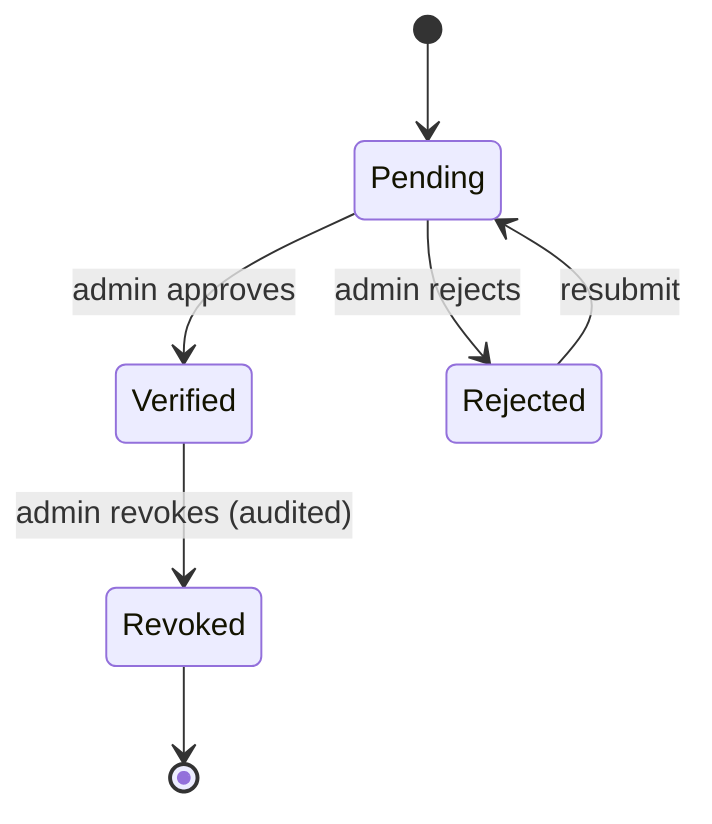
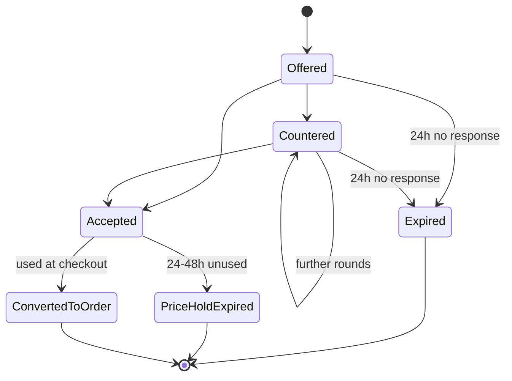
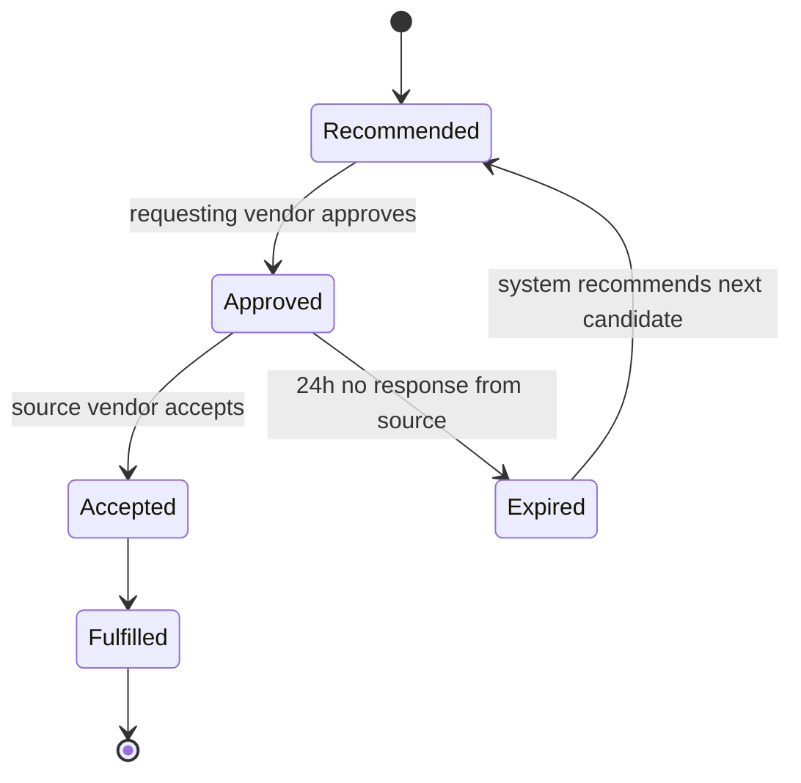
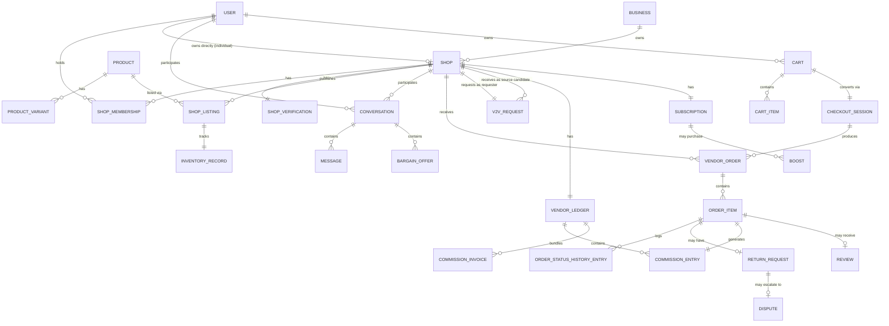

# PRODUCT REQUIREMENTS DOCUMENT (PRD)

# Vendors Hub — Product Requirements Document, Domain Model & Application/Use Cases

**Basis:** Vendors_Hub_Feature_Specification.md (Rounds 1–6, all locked decisions)
**Convention:** 🟢 Fact/locked requirement · 🟡 Assumption (flagged, not a locked decision) · ⚪ Open Question (explicitly undecided upstream)
**Priority scale (MoSCoW):** Must / Should / Could / Won’t (this release)

---

# PART 1 — PRODUCT REQUIREMENTS DOCUMENT (PRD)

## 1.1 Product Overview & Vision

Vendors Hub is a multivendor marketplace connecting customers with **verified physical shops** — not online-only sellers. The product’s purpose is to digitize existing physical retail (markets, malls, standalone shops, supermarkets) into a discoverable, transactable online presence, without severing the direct relationship between a shop and its customers.

**Vision statement:** *Make every verified physical shop in a city discoverable, ordering-capable, and reachable online — while leaving ownership of the customer relationship, pricing, and fulfillment with the shop itself.*

Launch approach: single city (Dhaka), one market segment, deliberately narrow scope, architected for multi-city/multi-country expansion later.

## 1.2 Problem Statement

Physical shop owners in the target market largely lack an affordable, trustworthy way to reach customers online. Existing options are either:

- Generic ecommerce platforms that don’t verify physical presence (enabling fraud and eroding buyer trust), or
- No digital presence at all, losing customers to shops that do have one.

Customers, meanwhile, cannot easily discover, compare, or transact with real, accountable local shops — search and social media are poor substitutes for structured discovery, and there is no trust signal equivalent to “this is a real shop I could walk into.”

Vendors Hub solves both sides by making **physical verification** the trust backbone of the marketplace, rather than an afterthought.

## 1.3 Goals & Objectives

| Goal | Objective |
| --- | --- |
| G1 | Onboard a critical mass of verified physical shops in the launch city before/alongside customer acquisition |
| G2 | Provide a transaction model (COD + vendor-direct payment) that requires no payment licensing overhead at launch |
| G3 | Preserve the shop-customer relationship as the durable unit of trust and continuity, independent of staff turnover |
| G4 | Establish a revenue model (subscriptions + commission + boosting) sustainable without platform money custody |
| G5 | Ship a focused V1 with explicitly deferred scope, avoiding speculative feature investment before product-market fit |

## 1.4 Target Users / Personas

| Persona | Description | Primary Needs |
| --- | --- | --- |
| **P1 — Shop Owner** | Owns 1+ verified physical shop(s), may or may not own a registered business entity | Get discovered online cheaply; manage listings/staff without technical complexity; get paid directly and quickly (no platform holding funds) |
| **P2 — Shop Staff (Manager/Salesperson)** | Works at one or more shops, handles day-to-day catalog, orders, and customer chat | Clear, scoped permissions; ability to fulfil orders and negotiate without needing Owner involvement for routine work |
| **P3 — Customer (Buyer)** | Wants to buy from real local shops with confidence | Trust that the shop is real; ability to compare/discover; ability to negotiate price (bargaining is culturally expected in the target market); simple COD option |
| **P4 — Platform Moderator/Admin** | Anthropic-internal… *(N/A — this is Vendors Hub’s own admin staff)* Reviews shop verification applications, disputes, and moderation reports | Efficient queues; enough evidence/audit trail to make fair decisions |
| **P5 — Business Owner (multi-shop)** | Owns a business entity with multiple shop branches | Oversight across shops; per-shop staff and verification management |

## 1.5 User Needs & Pain Points Addressed

| Pain Point | Addressed By |
| --- | --- |
| Buyers can’t tell if an online seller is a real, accountable shop | Per-shop physical verification (§ Feature Spec §5) |
| Sellers can’t afford/navigate payment-gateway marketplace licensing to start selling online | No platform money custody — COD + vendor-direct payment (§13.3) |
| Bargaining is a normal buying behavior in this market but unsupported by generic ecommerce | Structured in-chat bargaining (§9) |
| Shops lose customer history when staff quit | Customer relationship modeled at shop level, not staff level (§2.2) |
| Shops occasionally run out of stock but don’t want to lose the sale | V2V inter-vendor sourcing (§12) |
| Buyers are wary of fake reviews | Verified-purchase-only review gate (§11) |

## 1.6 Scope & Non-Goals

**In scope for V1:** see Feature Specification §1–§15 in full (organizational model, RBAC, verification, catalog, inventory, discovery/search, bargaining, cart/checkout, payments (non-custodial), order lifecycle, delivery (manual), returns/disputes, V2V, commission ledger, reviews, messaging, subscriptions/boosting (partial), baseline trust & safety).

**Explicit non-goals for V1** (see Feature Spec §16 for full deferral table and rationale):

- Jobs and To-Let classifieds
- AI-generated/enhanced imagery and visual search
- Product video
- Used/refurbished product listings
- Courier API integrations
- Multi-vendor COD
- Any platform-held funds, escrow, or split settlement
- Tiered shop verification levels
- Store-pickup time slots and delivery proof-of-capture
- MFA / secondary account recovery channels
- Dedicated search engine, distance-based ranking, sponsored search slots
- Native mobile apps
- Recommendations, voice search, AR, POS sync, competitive pricing tools

## 1.7 Key Features & Capabilities (Summary)

1. Central user identity with shop memberships and RBAC + overrides
2. Per-shop physical verification (binary: Pending/Verified/Rejected/Revoked)
3. Hybrid canonical-product + shop-listing catalog with variants
4. Dual inventory modes: exact-quantity or availability-label
5. Product-first and shop-first discovery via Postgres full-text search
6. Structured, chat-embedded bargaining with time-limited accepted-offer pricing
7. Multi-vendor cart with unified checkout producing independent per-vendor orders
8. Non-custodial payments: COD or vendor-direct online payment
9. Full order-item state machine with cancellation, rejection, returns, and disputes
10. Manual (non-API) delivery tracking across pickup/vendor-delivery/courier
11. Provisional-then-final per-item commission ledger, decoupled from money movement
12. V2V inter-vendor inventory coordination, invisible to the customer
13. Verified-purchase product + shop reviews
14. Shop-scoped (not staff-scoped) customer messaging with embedded bargaining
15. Subscription tiers gating listings/staff/boosting; boosting mechanics TBD
16. Baseline COD-abuse control and shared moderation-report taxonomy

## 1.8 Functional Requirements

Each requirement has a stable ID, description, and MoSCoW priority.

### Identity, Access & Verification

| ID | Requirement | Priority |
| --- | --- | --- |
| FR-001 | System shall allow a user to register/authenticate via phone number + OTP | Must |
| FR-002 | System shall maintain one central user identity supporting multiple concurrent role memberships (shop staff, business owner, customer) rather than a single fixed role | Must |
| FR-003 | System shall allow a user to own an individual shop directly or via a business entity owning multiple shops | Must |
| FR-004 | System shall support shop staff membership independent of a fixed 1:1 employment record, allowing one user to hold memberships at multiple shops | Must |
| FR-005 | System shall onboard staff via invite-and-accept, not direct credential creation by the shop | Must |
| FR-006 | System shall revoke a departed staff member’s access while preserving all historical records (orders, messages, bargains) under the shop | Must |
| FR-007 | System shall enforce RBAC with the locked permission matrix (Feature Spec §3.3) across all sensitive actions | Must |
| FR-008 | System shall support per-user/per-shop permission overrides layered on top of role defaults | Must |
| FR-009 | System shall require every shop to complete verification (Pending → Verified/Rejected) before it may publish listings or receive orders | Must |
| FR-010 | System shall perform verification per shop, never inherited from a parent business or sibling shop | Must |
| FR-011 | System shall allow a rejected shop to resubmit or appeal | Must |
| FR-012 | System shall support revoking a previously verified shop, recording an immutable audit trail of the revocation | Must |
| FR-013 | System shall support persistent multi-device sessions with a user-facing device-management/revocation screen | Should |
| FR-014 | System shall support OTP-only account recovery with manual/admin-assisted fallback for lost phone numbers | Must |

### Catalog & Inventory

| ID | Requirement | Priority |
| --- | --- | --- |
| FR-020 | System shall model products as canonical (platform/global) entities separate from shop-specific listings | Must |
| FR-021 | System shall allow each shop to create its own listing (price, availability, media) against a canonical product | Must |
| FR-022 | System shall support product variants (e.g., size, color, model) | Must |
| FR-023 | System shall restrict V1 catalog to new (non-used/refurbished) products | Must |
| FR-024 | System shall allow each listing to independently choose exact-quantity tracking or availability-label tracking | Must |
| FR-025 | System shall never expose exact inventory quantities to customers, regardless of tracking mode | Must |
| FR-026 | System shall keep out-of-stock listings visible rather than auto-hiding them | Must |

### Discovery & Search

| ID | Requirement | Priority |
| --- | --- | --- |
| FR-030 | System shall support product-first discovery (search → product → shops selling it) | Must |
| FR-031 | System shall support shop-first discovery (browse shop → shop’s products) | Must |
| FR-032 | System shall provide keyword full-text search over product and shop content using Postgres full-text search | Must |
| FR-033 | System shall support Bengali-language listing entry and search matching | Must |
| FR-034 | System shall support filtering and sorting of search results | Should |

### Bargaining

| ID | Requirement | Priority |
| --- | --- | --- |
| FR-040 | System shall allow a vendor to enable/disable bargaining per listing, default off | Must |
| FR-041 | System shall support structured offer/counter-offer exchanges embedded in the shop’s chat thread | Must |
| FR-042 | System shall auto-expire an unanswered offer/counter-offer after 24 hours | Must |
| FR-043 | System shall restrict bargain-response permission to Shop Owner/Manager by default, extensible to Salesperson via RBAC override | Must |
| FR-044 | System shall apply an accepted offer as a time-limited (24–48h), customer-specific price rather than a permanent listing-price change | Must |
| FR-045 | System shall not support quantity-tiered bargaining in V1 (single-unit price only) | Won’t (this release) |

### Cart, Checkout & Payments

| ID | Requirement | Priority |
| --- | --- | --- |
| FR-050 | System shall support a single cart containing items from multiple shops | Must |
| FR-051 | System shall produce one independent vendor order per shop from a single unified checkout session | Must |
| FR-052 | System shall allow independent delivery-method selection per vendor order | Must |
| FR-053 | System shall support COD/pay-at-store and vendor-specific online payment as the only V1 payment methods | Must |
| FR-054 | System shall prohibit a single COD payment from covering multiple vendor orders | Must |
| FR-055 | System shall never take custody of, hold, or move customer funds on the platform’s own account | Must |
| FR-056 | System shall not store customer payment credentials/tokens on the platform | Must |

### Order Lifecycle, Returns & Disputes

| ID | Requirement | Priority |
| --- | --- | --- |
| FR-060 | System shall implement the locked order-item state machine (Feature Spec §13.1) | Must |
| FR-061 | System shall allow a vendor to reject individual order items without rejecting the whole order | Must |
| FR-062 | System shall automatically release inventory reservation upon item rejection or cancellation | Must |
| FR-063 | System shall allow customer self-cancellation only while an item is in `Pending` state | Must |
| FR-064 | System shall enforce a 7-day minimum return window post-delivery, extensible (not reducible) by vendors | Must |
| FR-065 | System shall apply the locked return-reason → fault → refund-outcome mapping (Feature Spec §13.5) | Must |
| FR-066 | System shall withhold refund on vendor-online-payment orders until the returned item is received and inspected | Must |
| FR-067 | System shall auto-escalate an unresolved return dispute to Admin/Moderator after 3 days of vendor inactivity, or immediately on explicit objection | Must |
| FR-068 | System shall maintain an immutable order-status history recording status, timestamp, and acting party for every transition | Must |

### V2V Coordination

| ID | Requirement | Priority |
| --- | --- | --- |
| FR-070 | System shall allow a vendor to request inventory sourcing from another vendor when short on stock | Must |
| FR-071 | System shall recommend a source vendor automatically before the requesting vendor approves | Must |
| FR-072 | System shall auto-expire an unanswered V2V request after 24 hours and recommend the next-best candidate | Must |
| FR-073 | System shall ensure the requesting vendor’s shop remains the sole customer-facing fulfiller in a V2V-sourced order | Must |
| FR-074 | System shall never expose V2V inventory levels to customers | Must |

### Commission & Financial Ledger

| ID | Requirement | Priority |
| --- | --- | --- |
| FR-080 | System shall maintain a per-vendor financial ledger independent of actual money custody | Must |
| FR-081 | System shall calculate commission at the order-item level | Must |
| FR-082 | System shall keep commission provisional until the return/dispute window closes, then finalize it | Must |
| FR-083 | System shall generate a weekly commission invoice per vendor, separate from subscription billing | Must |

### Reviews & Messaging

| ID | Requirement | Priority |
| --- | --- | --- |
| FR-090 | System shall allow a review only from a customer whose order-item has reached `Completed` | Must |
| FR-091 | System shall capture both a product rating and a shop-service rating per completed order-item review | Must |
| FR-092 | System shall publish reviews immediately, subject to post-hoc report-and-takedown | Must |
| FR-093 | System shall maintain one conversation thread per customer-shop pair, accessible to any staff with messaging permission | Must |
| FR-094 | System shall embed bargain offers as structured message types within the same conversation thread | Must |

### Subscriptions, Boosting & Trust/Safety

| ID | Requirement | Priority |
| --- | --- | --- |
| FR-100 | System shall enforce listing-count and staff-seat caps per subscription tier | Must |
| FR-101 | System shall gate access to boosting by subscription tier | Must |
| FR-102 | System shall support a shared report-reason taxonomy across products, shops, reviews, and messages | Must |
| FR-103 | System shall disable COD for a customer after 3 undeliverable/no-show COD orders within a rolling 30-day window, with an appeal path | Must |
| FR-104 | System shall record sensitive order/financial operations to an audit trail (exact schema TBD) | Must |

## 1.9 Non-Functional Requirements

| ID | Requirement | Priority | Notes |
| --- | --- | --- | --- |
| NFR-001 | The platform must not require PCI-DSS or payment-institution licensing at launch | Must | Direct consequence of FR-055/FR-056 |
| NFR-002 | The system’s language/data model must support Bengali text without architectural rework | Must |  |
| NFR-003 | The architecture should permit later introduction of a dedicated search engine without a full catalog-model rewrite | Should |  |
| NFR-004 | The architecture should permit later introduction of platform-held payment settlement without breaking the existing commission-ledger model | Should | Ledger is designed decoupled from money movement precisely for this reason |
| NFR-005 | Sensitive state transitions (verification, financial, order status) must be individually auditable and immutable once recorded | Must |  |
| NFR-006 | The system should be designed as a modular monolith to minimize operational overhead pre-PMF | Should | Feature Spec §Q50 |
| NFR-007 | API should be REST, versioned by URL path | Should | Feature Spec §Q49 |
| NFR-008 | 🟡 Assumption: initial scale is single-city; no multi-region data residency requirement at launch | — | Not explicitly stated; flagged as assumption |
| NFR-009 | Performance/SLA targets | — | ⚪ Open Question — not yet defined |
| NFR-010 | Accessibility standard (WCAG level, etc.) | — | ⚪ Open Question — not yet defined |
| NFR-011 | Backup/disaster-recovery targets (RPO/RTO) | — | ⚪ Open Question — not yet defined |

## 1.10 Primary User Journeys

**J1 — Shop Onboarding (Owner):** Register (phone+OTP) → Create shop → Submit verification evidence → Automated pre-check → Human review → Verified → Create catalog listings → Invite staff.

**J2 — Customer Purchase with Bargaining:** Browse/search → View listing → Open chat, send offer → Vendor counters or accepts → Accepted offer becomes time-limited price → Add to cart at that price → Checkout (COD or vendor payment) → Vendor order created → Vendor confirms → Fulfillment → Delivery/pickup → Order completed → Customer leaves product + shop review.

**J3 — Multi-Vendor Checkout:** Customer adds items from Shop A and Shop B to one cart → Unified checkout → System creates Vendor Order A and Vendor Order B independently → Each proceeds through its own state machine, delivery method, and payment.

**J4 — Return Due to Defect:** Order `Completed` → Customer requests return within 7 days, reason “Defective” → Marked vendor-fault → Customer ships/returns item → Vendor receives and inspects → Refund issued including delivery fee.

**J5 — V2V Stockout Recovery:** Vendor A receives order for item they’re out of stock on → System recommends Vendor B as source → Vendor A approves request → Vendor B accepts → Vendor B supplies inventory to Vendor A → Vendor A fulfills the customer directly; customer is unaware two shops were involved.

**J6 — Staff Departure:** Owner removes a Salesperson’s shop membership → Salesperson’s access revoked immediately → All prior orders/messages/bargains they handled remain visible under the shop, attributed to the shop, with historical actor record intact.

## 1.11 Business Rules & Constraints (Consolidated)

See Feature Specification document §§1–15 for the complete, authoritative list. Key constraints repeated here for PRD self-containedness:

- A vendor must operate a verified physical shop; online-only sellers are ineligible.
- Verification is per-shop, never inherited.
- No platform money custody, ever, in V1.
- No multi-vendor COD.
- Customer relationship is owned by the shop, not by an individual staff member.
- Commission is provisional until the return/dispute window closes.
- Customers never see exact inventory counts or exact V2V stock levels.

## 1.12 Assumptions & Dependencies

| # | Assumption/Dependency | Type |
| --- | --- | --- |
| A1 | Vendors have reliable phone access for OTP-based authentication | Assumption |
| A2 | Launch city (Dhaka) has sufficient smartphone/internet penetration among target shop owners | Assumption |
| A3 | Postgres full-text search is sufficient for launch catalog size (not yet sized) | Assumption |
| A4 | Vendors are willing/able to operate their own online payment channel where offered (no platform payment gateway) | Assumption |
| A5 | Legal/compliance track (Vendor Agreement, ToS, Privacy Policy — Feature Spec §Q52) is produced in parallel and ready by launch | Dependency |
| A6 | Weekly commission invoicing assumes vendors have a reliable, disputable payment channel to settle the invoice against — the settlement mechanism for the invoice itself is ⚪ Open Question | Dependency / Open Question |

## 1.13 Success Metrics / KPIs

🟡 **Not explicitly locked in prior design rounds — the following are recommended starting KPIs, flagged as recommendations, not requirements:**

| Metric | Rationale |
| --- | --- |
| # Verified shops live in launch city | Core supply-side health (G1) |
| Vendor activation rate (verified → first listing published) | Onboarding friction indicator |
| Order completion rate (Completed / total order-items) | Core transaction health |
| Return/dispute rate | Trust & quality signal |
| COD abuse-flag rate | Fraud baseline effectiveness |
| Bargain-to-purchase conversion rate | Bargaining feature value |
| Weekly active shops (staff logging in / responding to messages) | Supply-side engagement |
| Commission collected vs. invoiced (collection rate) | Revenue-model viability, given non-custodial commission collection risk |

⚪ **Open Question:** No explicit target numbers or timeframes were set during design; these must be defined separately with business stakeholders.

## 1.14 Edge Cases & Failure Scenarios

| # | Scenario | Current Handling / Gap |
| --- | --- | --- |
| E1 | Vendor never responds to an accepted-bargain-created price before it expires | Time-limited price simply expires; customer must re-negotiate or buy at listed price. Handled. |
| E2 | Customer’s cart spans 3 shops, one shop rejects one item mid-fulfillment | Only that order-item transitions to `Rejected`; other vendor orders unaffected (independent state machines). Handled. |
| E3 | Vendor never pays their weekly commission invoice | ⚪ **Gap** — no enforcement/consequence mechanism defined (e.g., listing suspension) for non-payment. Open Question. |
| E4 | Customer loses access to their phone number (OTP) and has pending orders | Falls to manual/admin-assisted recovery (FR-014); no defined SLA for this support process. Partial gap. |
| E5 | Two vendors both get recommended as V2V source and requesting vendor’s demand is fulfilled by one, does the other’s pending recommendation auto-cancel? | ⚪ **Gap** — not addressed in locked V2V flow; only sequential (not parallel) sourcing was specified. |
| E6 | A shop is `Revoked` while it has open orders in flight | ⚪ **Gap** — no rule defined for whether existing orders continue to fulfillment or are force-cancelled. Open Question. |
| E7 | Vendor disables bargaining on a listing while an offer is mid-negotiation | ⚪ **Gap** — not addressed; recommend the in-flight negotiation should be allowed to complete, but this is not a locked decision. |
| E8 | Customer requests a return after COD (no online payment) — what exactly is “refunded”? | Only prepaid components (e.g., delivery fee if prepaid) apply; since no product payment was captured platform-side, “refund” for COD returns is really a vendor-customer cash/exchange matter outside the ledger. 🟡 Assumption, not explicitly locked. |
| E9 | Staff member with an active bargain-negotiation is removed from the shop mid-conversation | Per FR-006, history remains with shop; another authorized staff member must pick up the thread. No handoff notification mechanism defined — gap. |

## 1.15 MVP Scope vs. Future Enhancements

See Feature Specification §16 for the authoritative deferral table (Jobs, To-Let, AI features, product video, used goods, courier API, multi-vendor COD, platform-held funds, tiered verification, pickup slots, proof-of-delivery, MFA, dedicated search engine, native mobile apps, recommendations/voice/AR/POS).

## 1.16 Open Questions Requiring Clarification

Consolidated from the Feature Specification’s TBD Register (§18) plus new items surfaced while writing this PRD:

1. Merchant-of-record legal/financial classification
2. Commission rate, subscription pricing, billing cycles, platform-fee taxation
3. Product/listing field-level ownership split; variant architecture detail
4. Out-of-stock purchaseability/waitlist/auto-hide behavior
5. Country-specific verification evidence requirements; future verification tiering
6. Return evidence requirements; replacement-vs-refund policy; full dispute UI
7. Exact commission formula (discount/shipping/tax treatment)
8. Subscription trial/grace/upgrade-downgrade/failed-payment handling
9. Boosting purchase mechanics and pricing; its interaction with organic ranking
10. Full moderation escalation ladder and appeals process
11. Fraud/risk system beyond the V1 COD baseline
12. Audit event schema (fields, retention, export)
13. Messaging attachments/blocking/retention detail
14. Analytics metrics definitions per persona
15. Admin console workflow detail (verification queue, dispute console, reconciliation)
16. Field-level data model / schema
17. Regional legal/compliance beyond the 3-document launch floor
18. Mobile app strategy
19. **(New)** Consequence for vendor non-payment of commission invoice (E3)
20. **(New)** Parallel vs. strictly sequential V2V candidate recommendation (E5)
21. **(New)** Handling of in-flight orders when a shop’s verification is revoked (E6)
22. **(New)** Success metrics targets/timeframes (§1.13 is a recommendation, not a locked KPI set)

---

# PART 2 — DOMAIN MODEL

## 2.1 Bounded Contexts

The domain is partitioned into the following bounded contexts, each with its own ubiquitous language and internal consistency boundary. Contexts communicate via domain events and shared identifiers (never shared mutable state).

| Context | Responsibility |
| --- | --- |
| **Identity & Access** | User identity, sessions, shop membership, roles, permission overrides |
| **Shop & Verification** | Shop/Business lifecycle, verification workflow, shop settings |
| **Catalog & Inventory** | Canonical products, shop listings, variants, stock/availability |
| **Discovery** | Search indexing and query (reads from Catalog, does not own it) |
| **Bargaining & Messaging** | Conversations, structured offers, negotiated pricing |
| **Cart & Checkout** | Cart composition, checkout session orchestration |
| **Order Fulfillment** | Vendor orders, order items, state machine, delivery info |
| **Returns & Disputes** | Return requests, dispute escalation and resolution |
| **V2V Coordination** | Inter-vendor sourcing requests |
| **Financial Ledger** | Commission accrual/finalization, vendor ledger, invoicing (explicitly NOT payment execution) |
| **Reviews** | Product/shop review capture and publication |
| **Subscription & Billing (non-payment)** | Tier assignment, cap enforcement, boosting entitlement |
| **Trust & Safety** | Reports, moderation actions, COD-abuse tracking, audit log |

## 2.2 Core Entities, Responsibilities & Aggregate Boundaries

| Entity | Context | Responsibility | Aggregate Root? |
| --- | --- | --- | --- |
| **User** | Identity & Access | Central identity; holds phone/OTP credential, sessions, addresses | ✅ Yes (User aggregate) |
| **ShopMembership** | Identity & Access | Links a User to a Shop with a Role + overrides; tracks invite/accept/removal | Entity inside **Shop** aggregate |
| **Business** | Shop & Verification | Groups multiple Shops under one owning entity | ✅ Yes (Business aggregate — thin) |
| **Shop** | Shop & Verification | Owns memberships, verification status, settings; is the unit of trust and customer relationship | ✅ Yes (Shop aggregate) |
| **ShopVerification** | Shop & Verification | Tracks verification state transitions and evidence | Entity inside **Shop** aggregate |
| **Product** (canonical) | Catalog & Inventory | Platform-controlled product identity and shared attributes | ✅ Yes (Product aggregate) |
| **ProductVariant** | Catalog & Inventory | A specific variant (size/color/model) of a canonical Product | Entity inside **Product** aggregate |
| **ShopListing** | Catalog & Inventory | A shop’s own price/availability/media against a Product | ✅ Yes (ShopListing aggregate — references Product by ID only) |
| **InventoryRecord** | Catalog & Inventory | Quantity or availability-label state for a listing | Entity/Value inside **ShopListing** aggregate |
| **Conversation** | Bargaining & Messaging | One thread per customer-shop pair; owns Messages and embedded Offers | ✅ Yes (Conversation aggregate) |
| **Message** | Bargaining & Messaging | A single chat entry (plain text or structured offer type) | Entity inside **Conversation** |
| **BargainOffer** | Bargaining & Messaging | An offer/counter-offer with price, expiry, status | Entity inside **Conversation** |
| **Cart** | Cart & Checkout | Customer’s in-progress multi-shop selection | ✅ Yes (Cart aggregate) |
| **CheckoutSession** | Cart & Checkout | Orchestrates conversion of a Cart into multiple VendorOrders | ✅ Yes (CheckoutSession aggregate — short-lived, mostly a process/saga) |
| **VendorOrder** | Order Fulfillment | One shop’s portion of a checkout; owns OrderItems, status history, delivery info | ✅ Yes (VendorOrder aggregate) |
| **OrderItem** | Order Fulfillment | A single product line within a VendorOrder, with its own state machine | Entity inside **VendorOrder** |
| **OrderStatusHistoryEntry** | Order Fulfillment | Immutable record of a transition | Entity (append-only) inside **VendorOrder** |
| **ReturnRequest** | Returns & Disputes | A return/refund request against a specific OrderItem | ✅ Yes (ReturnRequest aggregate — references OrderItem by ID) |
| **Dispute** | Returns & Disputes | An escalated disagreement over a ReturnRequest | Entity inside **ReturnRequest** aggregate (or promoted to its own aggregate if it outlives the return — see §2.9 ambiguity note) |
| **V2VRequest** | V2V Coordination | A sourcing request from one shop to another | ✅ Yes (V2VRequest aggregate) |
| **VendorLedger** | Financial Ledger | Per-vendor running record of commission entries | ✅ Yes (VendorLedger aggregate) |
| **CommissionEntry** | Financial Ledger | A single provisional/final commission line tied to an OrderItem | Entity inside **VendorLedger** |
| **CommissionInvoice** | Financial Ledger | A periodic (weekly) invoice bundling finalized entries | Entity inside **VendorLedger** |
| **Review** | Reviews | Product-rating + shop-rating pair tied to a completed OrderItem | ✅ Yes (Review aggregate) |
| **Subscription** | Subscription & Billing | A shop’s current tier and cap usage | ✅ Yes (Subscription aggregate) |
| **Boost** | Subscription & Billing | A purchased visibility boost, time-bound | Entity inside **Subscription** aggregate (or its own — see §2.9) |
| **Report** | Trust & Safety | A moderation report against any reportable entity | ✅ Yes (Report aggregate) |
| **AuditLogEntry** | Trust & Safety | Immutable record of a sensitive action | ✅ Yes (append-only log, not a true DDD aggregate — no invariants to protect beyond immutability) |

## 2.3 Value Objects

| Value Object | Fields (illustrative) | Used By |
| --- | --- | --- |
| **PhoneNumber** | country code, number, verified flag | User |
| **Money** | amount, currency | Listing price, BargainOffer, CommissionEntry, CommissionInvoice |
| **AvailabilityLabel** | enum: InStock / Limited / Available / OutOfStock | InventoryRecord |
| **Address** | line1, line2, city, area, geo-coordinates (optional) | User (delivery addresses) |
| **RatingScore** | integer 1–5 | Review |
| **DateWindow** | start, end/duration | BargainOffer expiry, ReturnRequest window, V2V request expiry, price-hold window |
| **OTPChallenge** | code hash, expiry, attempt count | Authentication (not modeled as a persistent entity beyond its short life) |
| **CommissionRate** | percentage or formula reference | CommissionEntry — ⚪ formula itself is TBD |

## 2.4 Domain Events (Illustrative, Not Exhaustive)

| Event | Emitted By (Aggregate) | Notable Consumers |
| --- | --- | --- |
| `UserRegistered` | User | Identity & Access, Notifications |
| `StaffInvited` / `StaffJoined` / `StaffRemoved` | Shop | Trust & Safety (audit), Notifications |
| `ShopSubmittedForVerification` | Shop | Shop & Verification (admin queue) |
| `ShopVerified` / `ShopRejected` / `ShopVerificationRevoked` | Shop | Catalog (listing publishability), Notifications, Audit |
| `ShopListingCreated` / `ListingPriceChanged` | ShopListing | Discovery (search index), Notifications (price-watchers — future) |
| `InventoryDepleted` | ShopListing | V2V Coordination (may trigger a request) |
| `BargainOfferMade` / `BargainOfferCountered` / `BargainOfferAccepted` / `BargainOfferExpired` | Conversation | Cart & Checkout (special price), Notifications |
| `CartCheckedOut` | Cart / CheckoutSession | Order Fulfillment (creates VendorOrders) |
| `VendorOrderCreated` | VendorOrder | Financial Ledger (provisional commission), Notifications |
| `OrderItemConfirmed` / `OrderItemRejected` / `OrderItemCancelled` | VendorOrder | Catalog (inventory release), Financial Ledger, Notifications |
| `OrderItemShipped` / `OrderItemDelivered` / `OrderItemCompleted` | VendorOrder | Financial Ledger (commission finalization timer start), Reviews (eligibility unlock), Notifications |
| `ReturnRequested` / `ReturnApproved` / `ReturnDenied` | ReturnRequest | Financial Ledger (commission hold), Notifications |
| `DisputeRaised` / `DisputeResolved` | Dispute | Trust & Safety (admin queue), Audit |
| `CommissionAccrued` (provisional) / `CommissionFinalized` | VendorLedger | CommissionInvoice generation |
| `CommissionInvoiceIssued` | VendorLedger | Notifications (vendor) |
| `V2VRequestCreated` / `V2VRequestAccepted` / `V2VRequestExpired` | V2VRequest | Catalog (inventory transfer), Notifications |
| `ReviewSubmitted` | Review | Catalog (product rating aggregate), Shop (rating aggregate), Trust & Safety (reportable) |
| `MessageSent` | Conversation | Notifications |
| `CODDisabledForCustomer` | (Trust & Safety, derived from Order Fulfillment history) | Cart & Checkout (payment-method gating), Notifications |
| `ReportFiled` / `ModerationActionTaken` | Report | Trust & Safety queue, Audit |
| `SubscriptionTierChanged` | Subscription | Catalog (cap enforcement), Notifications |
| `BoostPurchased` | Subscription | Discovery (ranking input) |

## 2.5 Commands (Illustrative, Not Exhaustive)

| Command | Target Aggregate | Guarded By (Invariant/Permission) |
| --- | --- | --- |
| `RegisterUser`, `VerifyOTP` | User | — |
| `CreateShop` | Business/User → new Shop | Must be Verified=false initially (new shops start Pending or Unsubmitted) |
| `InviteStaff`, `AcceptStaffInvite`, `RemoveStaffMember` | Shop | Owner-only for invite/remove (FR: RBAC matrix) |
| `SubmitShopForVerification` | Shop | Requires minimum evidence set present |
| `ApproveShopVerification`, `RejectShopVerification`, `RevokeShopVerification` | Shop | Admin-only |
| `CreateCanonicalProduct` | Product | Admin or platform-curated in V1 — ⚪ **ambiguous, see §2.9** |
| `CreateShopListing`, `UpdateListingPrice`, `SetAvailabilityLabel`, `AdjustInventoryQuantity` | ShopListing | Owner/Manager only |
| `EnableBargainingOnListing` | ShopListing | Owner/Manager only |
| `MakeBargainOffer`, `CounterBargainOffer`, `AcceptBargainOffer` | Conversation | Customer (offer/counter as buyer) or Owner/Manager/permitted Salesperson (vendor side) |
| `AddToCart`, `RemoveFromCart` | Cart | Customer |
| `Checkout` | Cart → CheckoutSession | Requires all cart items still available/priced correctly |
| `ConfirmOrderItem`, `RejectOrderItem` | VendorOrder | Owner/Manager/Salesperson (reject), only while item in `Pending`/`Confirmed` |
| `CancelOrderItem` | VendorOrder | Customer, only while item in `Pending` |
| `MarkItemShipped`, `MarkItemDelivered`, `MarkItemCompleted` | VendorOrder | Vendor staff |
| `RequestReturn` | ReturnRequest | Customer, only within return window, only from `Completed` |
| `ApproveReturn`, `DenyReturn` | ReturnRequest | Owner/Manager |
| `RaiseDispute`, `ResolveDispute` | Dispute | Either party raises; Admin/Moderator resolves |
| `AccrueCommission`, `FinalizeCommission`, `IssueCommissionInvoice` | VendorLedger | System-triggered (not user command) |
| `CreateV2VRequest`, `ApproveV2VRequest`, `AcceptV2VRequest` | V2VRequest | Owner/Manager on both sides |
| `SubmitReview` | Review | Customer, only if OrderItem is `Completed` and not already reviewed |
| `SendMessage` | Conversation | Customer or permitted staff |
| `DisableCODForCustomer` | (system/Trust & Safety) | System-triggered by rule threshold |
| `FileReport`, `TakeModerationAction` | Report | Any user (file); Moderator/Admin (action) |
| `PurchaseBoost`, `ChangeSubscriptionTier` | Subscription | Owner |

## 2.6 Key Invariants & Business Rules

| # | Invariant | Enforced On |
| --- | --- | --- |
| I1 | A Shop cannot publish a listing or receive orders unless `ShopVerification.status = Verified` | Shop / ShopListing |
| I2 | Verification status is per-Shop; never derived from a sibling Shop or parent Business | Shop |
| I3 | An OrderItem may only transition to `Cancelled` from `Pending` | VendorOrder |
| I4 | An OrderItem may only transition to `Rejected` from `Pending` or `Confirmed` | VendorOrder |
| I5 | A ReturnRequest may only be created from an OrderItem in `Completed` state, within the active return window | ReturnRequest |
| I6 | A CommissionEntry remains `Provisional` until its owning OrderItem’s return/dispute window has elapsed with no open ReturnRequest/Dispute | VendorLedger |
| I7 | No aggregate outside VendorLedger may record custody of customer funds | Global constraint (architectural invariant, not enforced by a single aggregate) |
| I8 | A single COD payment may never be associated with more than one VendorOrder | Cart & Checkout / VendorOrder |
| I9 | A Review may be created only once per (Customer, OrderItem) pair, and only if that OrderItem is `Completed` | Review |
| I10 | A BargainOffer not responded to within 24 hours transitions to `Expired` automatically | Conversation |
| I11 | An accepted BargainOffer produces a price valid only for the originating customer, and only for 24–48 hours | Conversation / Cart |
| I12 | A V2VRequest unanswered by the source vendor within 24 hours transitions to `Expired`, triggering a new recommendation | V2VRequest |
| I13 | Customer-visible inventory data is always an AvailabilityLabel, never an exact quantity, regardless of the listing’s internal tracking mode | ShopListing (read-model boundary) |
| I14 | A ShopMembership removal does not cascade-delete or reassign historical Orders/Messages/BargainOffers associated with that staff member — they remain attributed to the Shop | Shop / VendorOrder / Conversation |
| I15 | Subscription tier caps (listing count, staff seats) are enforced at the point of creation (cannot create the (N+1)th listing/seat over cap) | ShopListing / ShopMembership, validated against Subscription |

## 2.7 Entity Lifecycle / State Transitions

### 2.7.1 OrderItem State Machine

### 2.7.2 Shop Verification State Machine

### 2.7.3 BargainOffer State Machine

### 2.7.4 V2VRequest State Machine

## 2.8 Entity-Relationship Overview

## 2.9 Modeling Decisions — Reasoning & Ambiguities

**Why VendorOrder (not the parent CheckoutSession) is the primary transactional aggregate:** Every locked business rule (item-level rejection, independent delivery methods, no multi-vendor COD, per-vendor commission) operates at the single-vendor-order level. CheckoutSession is modeled as a thin, short-lived orchestration/process — it fans out into VendorOrders and then has no further independent lifecycle. This matches the locked decision that unified checkout produces “separate vendor orders,” not one composite order object.

**Why ShopListing is its own aggregate, not a child of Product:** A Product (canonical) is platform-owned and shared across many shops; a ShopListing is vendor-owned and mutated independently (price, stock) at a much higher frequency and by a different actor (the vendor, not the platform). Coupling them into one aggregate would force every price change to load and lock the shared canonical product, creating unnecessary contention across unrelated shops selling the same product.

**Why Conversation owns BargainOffer rather than a separate Bargain aggregate:** The locked decision explicitly states bargaining happens “embedded in the shop’s chat thread” as structured message types — this is a strong signal that offers are not an independently addressable domain concept but a specialization of Message within one Conversation’s consistency boundary.

**⚪ Ambiguity 1 — Who creates a canonical Product?** The Feature Spec locks the hybrid canonical + listing model but never specifies *who* is authorized to create a new canonical Product entity (platform admin curation vs. first vendor to list it, subject to later admin merge/dedupe). This materially affects the `CreateCanonicalProduct` command’s authorization and is flagged as an open question, not resolved here.

**⚪ Ambiguity 2 — Dispute as a sub-entity vs. independent aggregate:** A Dispute is modeled here as a child of ReturnRequest because it always originates from one. However, a Dispute’s resolution can outlive and reference facts beyond the return itself (e.g., broader account standing, repeat-offender patterns for Trust & Safety). If Trust & Safety needs to correlate Disputes across multiple ReturnRequests independent of any single return’s lifecycle, Dispute may need promotion to its own aggregate with a reference (not ownership) relationship to ReturnRequest. Flagged, not resolved — no locked decision addresses this.

**⚪ Ambiguity 3 — Boost as child of Subscription vs. independent aggregate:** Boosting mechanics are entirely ⚪ TBD (Feature Spec §14.3). Modeling it as a child entity of Subscription is a structural placeholder only; if boosting acquires its own lifecycle independent of subscription tier changes (e.g., one-off purchases unrelated to the subscription cycle), it should be promoted to its own aggregate. This cannot be finalized until boosting mechanics are decided.

**⚪ Ambiguity 4 — Potential conflict between I6 (commission provisional until dispute window closes) and I8 (weekly invoicing cadence):** If a dispute takes longer than a week to resolve, does the weekly invoice simply exclude that still-provisional entry (carrying it to the next invoice), or does invoicing pause entirely for that vendor? The locked decisions establish both rules independently but never reconcile their interaction. Recommended default: invoices include only entries that have finalized by the invoice cut-off date; unresolved entries roll forward. This is a **recommendation**, not a locked decision — flagged for confirmation.

---

# PART 3 — APPLICATION / USE CASES

Use cases are grouped by bounded context. Each includes the full requested structure. Representative core use cases are detailed; less critical variants are noted more briefly where the pattern is repetitive.

## 3.1 Identity & Access

### UC-01: Register and Authenticate via Phone OTP

- **Business objective:** Allow any user to gain platform access without a password, matching regional norms
- **Primary actor:** Prospective User (customer, vendor, or staff)
- **Supporting actors/systems:** SMS/OTP delivery provider (external)
- **Trigger:** User opens the app/site and chooses to sign in
- **Preconditions:** None (new or returning user)
- **Inputs:** Phone number
- **Main success flow:**
    1. User enters phone number
    2. System sends OTP via SMS
    3. User enters OTP
    4. System verifies OTP, creates User if new, or logs in existing User
    5. System creates a persistent device session
- **Alternative flows:** User re-requests OTP after expiry/non-receipt
- **Exception/error flows:** OTP mismatch (retry with limit); OTP delivery failure (system/provider issue, surfaced to user)
- **Business rules involved:** FR-001, FR-002
- **Domain entities affected:** User (created/loaded)
- **Commands/Events:** `RegisterUser`/`VerifyOTP` → `UserRegistered`
- **Outputs:** Authenticated session
- **Postconditions:** User has an active session on the device
- **Authorization:** None required (this is the auth entry point)
- **Idempotency:** OTP verification must be idempotent against replay of the same code within its validity window; a second identical verification should not create a duplicate User

### UC-02: Invite and Onboard Shop Staff

- **Business objective:** Allow shops to build a team without creating platform-owned credentials for staff
- **Primary actor:** Shop Owner (or Manager, if permitted)
- **Trigger:** Owner initiates a staff invite
- **Preconditions:** Shop exists; actor has staff-management permission (RBAC)
- **Inputs:** Invitee phone number, proposed role
- **Main success flow:**
    1. Owner sends invite with proposed Role
    2. System notifies invitee (existing or prompts registration via UC-01)
    3. Invitee accepts
    4. System creates ShopMembership, activates permissions
- **Alternative flows:** Invitee declines; invite expires unaccepted
- **Exception/error flows:** Inviting a phone number already a member of the shop (rejected, no duplicate)
- **Business rules:** FR-004, FR-005, FR-007
- **Domain entities affected:** Shop (ShopMembership child entity)
- **Commands/Events:** `InviteStaff` → (accept) `AcceptStaffInvite` → `StaffJoined`
- **Outputs:** Active ShopMembership
- **Postconditions:** Invitee has scoped access per their Role
- **Authorization:** Owner-only (Manager per RBAC override, not by default)
- **Idempotency:** Re-inviting an already-invited-but-pending phone number should refresh, not duplicate, the invite

### UC-03: Remove Staff Member

- **Business objective:** Revoke access on departure while preserving history
- **Primary actor:** Shop Owner
- **Preconditions:** Target ShopMembership is active
- **Main success flow:** Owner removes member → System revokes access immediately → Historical Orders/Messages/BargainOffers remain shop-attributed (I14)
- **Business rules:** FR-006, I14
- **Domain entities affected:** Shop (ShopMembership marked removed)
- **Commands/Events:** `RemoveStaffMember` → `StaffRemoved`
- **Postconditions:** Former staff member has zero access to the shop; existing records unchanged
- **Authorization:** Owner-only

## 3.2 Shop & Verification

### UC-04: Submit Shop for Verification

- **Business objective:** Gate marketplace participation on physical-shop legitimacy
- **Primary actor:** Shop Owner
- **Trigger:** Owner completes shop profile and evidence upload
- **Preconditions:** Shop created, in `Unsubmitted`/`Rejected` state
- **Inputs:** Business license, location proof, owner documentation (exact requirements ⚪ TBD)
- **Main success flow:** Owner submits → automated checks run → queued for human review
- **Business rules:** FR-009, FR-010
- **Domain entities affected:** Shop, ShopVerification (→ `Pending`)
- **Commands/Events:** `SubmitShopForVerification` → `ShopSubmittedForVerification`
- **Postconditions:** Shop is in `Pending`, cannot yet publish listings (I1)

### UC-05: Admin Approves/Rejects Verification

- **Business objective:** Human-in-the-loop trust gate
- **Primary actor:** Admin
- **Preconditions:** Shop in `Pending`
- **Main success flow:** Admin reviews evidence → Approves → Shop becomes `Verified`, can now publish
- **Alternative flow:** Admin rejects with reason → Shop may resubmit (UC-04) or appeal
- **Business rules:** FR-009, FR-011, I1, I2
- **Domain entities affected:** Shop/ShopVerification
- **Commands/Events:** `ApproveShopVerification` → `ShopVerified` (or `RejectShopVerification` → `ShopRejected`)
- **Authorization:** Admin-only
- **Postconditions:** Catalog publishing unblocked (Verified) or blocked pending resubmission (Rejected)

### UC-06: Admin Revokes Verification

- **Business objective:** Remove trust badge and marketplace access when a shop is found non-compliant
- **Primary actor:** Admin
- **Preconditions:** Shop currently `Verified`
- **Main success flow:** Admin revokes with reason → Shop transitions to `Revoked`, immutably audited
- **⚪ Open question surfaced:** Handling of in-flight VendorOrders at revocation time is undefined (Edge Case E6) — main flow assumes existing orders are allowed to complete, but this is a **recommendation**, not a locked rule
- **Business rules:** FR-012
- **Commands/Events:** `RevokeShopVerification` → `ShopVerificationRevoked`
- **Authorization:** Admin-only

## 3.3 Catalog & Inventory

### UC-07: Create Shop Listing from Canonical Product

- **Business objective:** Let a verified shop offer a product for sale
- **Primary actor:** Shop Owner/Manager
- **Preconditions:** Shop is `Verified` (I1); Subscription listing cap not exceeded (I15)
- **Inputs:** Canonical Product reference (or new product request — see Ambiguity 1), price, initial availability/inventory mode, media
- **Main success flow:** Vendor selects/creates product → sets listing price and inventory mode → publishes
- **Exception flows:** Listing cap exceeded → rejected with upgrade prompt (FR-100)
- **Business rules:** FR-020–FR-026, I1, I15
- **Domain entities affected:** ShopListing (created), InventoryRecord
- **Commands/Events:** `CreateShopListing` → `ShopListingCreated`
- **Authorization:** Owner/Manager only (RBAC matrix)

### UC-08: Adjust Inventory / Availability

- **Business objective:** Keep stock signals accurate without exposing exact counts
- **Primary actor:** Owner/Manager/Salesperson (inventory management is open to all three per RBAC matrix)
- **Main success flow:** Staff updates quantity (if exact-tracked) or availability label (if label-mode) → System recomputes customer-facing AvailabilityLabel (I13)
- **Business rules:** FR-024, FR-025, I13
- **Commands/Events:** `AdjustInventoryQuantity`/`SetAvailabilityLabel` → (no customer-facing event beyond listing update)

## 3.4 Bargaining & Messaging

### UC-09: Customer Makes a Bargain Offer

- **Business objective:** Support culturally-expected price negotiation
- **Primary actor:** Customer
- **Preconditions:** Listing has bargaining enabled (FR-040); Conversation exists or is created for this customer-shop pair
- **Inputs:** Proposed price
- **Main success flow:** Customer sends offer in chat → Vendor (Owner/Manager/permitted Salesperson) notified → Vendor accepts, counters, or lets it expire
- **Alternative flow — Counter:** Vendor counters → Customer accepts, counters again, or lets expire
- **Exception flow:** No response within 24h → Offer `Expired` (I10)
- **Business rules:** FR-040–FR-044, I10, I11
- **Domain entities affected:** Conversation, BargainOffer
- **Commands/Events:** `MakeBargainOffer` → `BargainOfferMade`; `CounterBargainOffer` → `BargainOfferCountered`; `AcceptBargainOffer` → `BargainOfferAccepted`
- **Postconditions (on acceptance):** A time-limited (24–48h), customer-specific price exists, usable at checkout for this customer only (I11)
- **Authorization:** Vendor-side response requires bargain permission (Owner/Manager by default, Salesperson via override — FR-043)
- **Idempotency:** Duplicate identical offers within a short window should be treated as a no-op/rejected to avoid offer-spam

### UC-10: Customer Sends a Regular Message

- **Business objective:** General customer-shop communication independent of bargaining
- **Primary actor:** Customer or permitted staff
- **Main success flow:** Message sent into the shared Conversation thread → visible to any staff with messaging permission (not a specific individual)
- **Business rules:** FR-093, FR-094, I14
- **Commands/Events:** `SendMessage` → `MessageSent`

## 3.5 Cart & Checkout

### UC-11: Add Items from Multiple Shops to Cart

- **Business objective:** Allow one shopping session to span multiple vendors
- **Primary actor:** Customer
- **Main success flow:** Customer adds items from Shop A, then Shop B, into one Cart, organized by shop
- **Business rules:** FR-050
- **Domain entities affected:** Cart, CartItem

### UC-12: Checkout Producing Multiple Vendor Orders

- **Business objective:** Convert a multi-shop cart into independently manageable vendor orders
- **Primary actor:** Customer
- **Preconditions:** Cart non-empty; each item’s price/availability re-validated at checkout time (including any active bargain-accepted price, I11); COD eligibility checked per FR-103 if COD selected
- **Main success flow:**
    1. Customer selects delivery method and payment method **per vendor** (FR-052, FR-053)
    2. System validates each shop’s items independently
    3. System creates one VendorOrder per shop, each starting all items at `Pending`
    4. CheckoutSession completes; Cart is cleared
- **Alternative flow:** One shop’s items fail validation (e.g., item went out of stock) — that shop’s sub-checkout fails/adjusts while other shops proceed (aggregate independence, I8 analog)
- **Exception flow:** Customer attempts multi-vendor COD in one payment — explicitly disallowed (I8); system forces per-vendor COD confirmation
- **Business rules:** FR-050–FR-054, I8, I11
- **Domain entities affected:** Cart, CheckoutSession, VendorOrder (multiple), OrderItem (multiple)
- **Commands/Events:** `Checkout` → `CartCheckedOut` → (fan-out) `VendorOrderCreated` × N
- **Outputs:** N independent VendorOrders
- **Postconditions:** Each VendorOrder proceeds through its own state machine independently
- **Consistency consideration:** This is the primary multi-aggregate transaction boundary in the system — see §5.6 for the recommended saga/process-manager treatment rather than a single ACID transaction across shops

## 3.6 Order Fulfillment

### UC-13: Vendor Confirms or Rejects an Order Item

- **Business objective:** Let vendor accept the sale or decline availability at the item level
- **Primary actor:** Owner/Manager/Salesperson
- **Preconditions:** OrderItem in `Pending`
- **Main success flow:** Vendor confirms → item moves to `Confirmed`
- **Alternative flow:** Vendor rejects → item moves to `Rejected`; inventory reservation released automatically (FR-062)
- **Business rules:** FR-061, FR-062, I3, I4
- **Commands/Events:** `ConfirmOrderItem`/`RejectOrderItem` → `OrderItemConfirmed`/`OrderItemRejected`
- **Postconditions:** Reserved inventory released on rejection; commission entry not accrued for rejected items

### UC-14: Customer Cancels Order Item

- **Business objective:** Allow a no-friction pre-commitment exit
- **Primary actor:** Customer
- **Preconditions:** OrderItem strictly in `Pending` (I3)
- **Main success flow:** Customer cancels → item moves to `Cancelled`; inventory released
- **Exception flow:** Attempt to cancel a `Confirmed`+ item is rejected; customer directed to return process instead (once delivered) or asked to contact the vendor
- **Business rules:** FR-063, I3

### UC-15: Fulfillment Progression (Processing → Delivered → Completed)

- **Business objective:** Track physical fulfillment to completion
- **Primary actor:** Vendor staff
- **Main success flow:** Staff manually advances item through `Processing → Ready → Shipped/PickedUp → Delivered` (no courier API — manual entry, FR: Feature Spec §Delivery); system auto-or-manually marks `Completed` after a defined post-delivery period (⚪ exact “when does Delivered become Completed” trigger is not explicitly locked — **assumption:** immediate or after the return window opens, flagged as open question)
- **Business rules:** Immutable status history (FR-068)
- **Domain entities affected:** OrderItem, OrderStatusHistoryEntry (one per transition)
- **Commands/Events:** `MarkItemShipped`/`MarkItemDelivered`/`MarkItemCompleted` → corresponding events
- **Postconditions:** `Completed` unlocks Review eligibility (I9) and starts the return window (I5)

## 3.7 Returns & Disputes

### UC-16: Customer Requests a Return

- **Business objective:** Enforce minimum consumer protection with clear fault attribution
- **Primary actor:** Customer
- **Preconditions:** OrderItem `Completed`; within 7-day (or vendor-extended) window (I5)
- **Inputs:** Return reason (one of the 5 locked categories)
- **Main success flow:** Customer selects reason → System applies the locked reason→fault mapping → ReturnRequest created, item moves to `ReturnRequested`
- **Business rules:** FR-064, FR-065, I5
- **Domain entities affected:** ReturnRequest (created), OrderItem (state transition)
- **Commands/Events:** `RequestReturn` → `ReturnRequested`

### UC-17: Vendor Approves/Denies Return

- **Primary actor:** Owner/Manager
- **Main success flow:** Vendor reviews reason/evidence → Approves (→ `ReturnApproved` → customer ships/returns item → `Returned` → refund per fault mapping, FR-066) or Denies (→ `ReturnDenied`)
- **Business rules:** FR-065, FR-066
- **Commands/Events:** `ApproveReturn`/`DenyReturn`

### UC-18: Dispute Auto-Escalation and Resolution

- **Business objective:** Guarantee unresolved disagreements reach a neutral party
- **Primary actor:** System (trigger), Admin/Moderator (resolution)
- **Trigger:** 3 days of vendor inactivity on a ReturnRequest, OR explicit objection by either party
- **Main success flow:** System auto-escalates → Admin reviews → Resolves in favor of customer (`ReturnApproved`) or vendor (`ReturnDenied`)
- **Business rules:** FR-067
- **Domain entities affected:** ReturnRequest, Dispute
- **Commands/Events:** (system) → `DisputeRaised`; `ResolveDispute` → `DisputeResolved`
- **Authorization:** Resolution requires Admin/Moderator role

## 3.8 V2V Coordination

### UC-19: Requesting Vendor Initiates V2V Sourcing

- **Business objective:** Recover a stockout without losing the sale
- **Primary actor:** Requesting Vendor (Owner/Manager)
- **Trigger:** Vendor identifies insufficient stock for an incoming/pending order
- **Main success flow:**
    1. Requesting vendor initiates a sourcing need
    2. System recommends a candidate source Shop
    3. Requesting vendor approves the recommendation
    4. Source vendor accepts
    5. Source vendor supplies inventory to requesting vendor (physically/administratively — exact mechanics ⚪ TBD)
    6. Requesting vendor fulfills the customer directly
- **Alternative flow:** Source vendor doesn’t respond in 24h → request expires → system recommends next candidate (loop back to step 2)
- **Business rules:** FR-070–FR-074, I12
- **Domain entities affected:** V2VRequest
- **Commands/Events:** `CreateV2VRequest` → `V2VRequestCreated`; `ApproveV2VRequest`; `AcceptV2VRequest` → `V2VRequestAccepted`; (timeout) → `V2VRequestExpired`
- **Postconditions:** Customer’s order is fulfilled by the requesting vendor with no visible indication a second shop was involved (FR-073, FR-074)

## 3.9 Financial Ledger

### UC-20: Commission Accrual and Finalization

- **Business objective:** Track commission owed without holding money
- **Primary actor:** System (fully automated; no direct user actor)
- **Trigger:** `VendorOrderCreated` (accrual, provisional) and, later, return/dispute window elapsing without an open case (finalization)
- **Main success flow:**
    1. On order-item confirmation, a provisional CommissionEntry is created in the vendor’s VendorLedger (FR-081, I6)
    2. When the return/dispute window closes with no open ReturnRequest/Dispute, the entry transitions to `Final`
    3. On the weekly invoicing cycle, all `Final` entries not yet invoiced are bundled into a CommissionInvoice (FR-083)
- **Alternative flow:** If a ReturnRequest is open at the item’s return-window boundary, the CommissionEntry remains `Provisional`, held from invoicing until resolved (Ambiguity 4 — recommended behavior, not explicitly locked)
- **Business rules:** FR-080–FR-083, I6
- **Domain entities affected:** VendorLedger, CommissionEntry, CommissionInvoice
- **Commands/Events:** (system) `AccrueCommission` → `CommissionAccrued`; `FinalizeCommission` → `CommissionFinalized`; `IssueCommissionInvoice` → `CommissionInvoiceIssued`
- **Postconditions:** Vendor has a payable invoice; **actual payment/settlement of this invoice is out of this system’s scope** (⚪ open question — no locked mechanism for how the vendor actually pays the platform)

## 3.10 Reviews

### UC-21: Customer Submits a Review

- **Primary actor:** Customer
- **Preconditions:** OrderItem `Completed`; no prior review exists for this (Customer, OrderItem) pair (I9)
- **Main success flow:** Customer rates product + shop service, optionally with text → Review published immediately (FR-092)
- **Business rules:** FR-090, FR-091, FR-092, I9
- **Commands/Events:** `SubmitReview` → `ReviewSubmitted`
- **Postconditions:** Product’s and Shop’s aggregate ratings recalculated

## 3.11 Trust & Safety

### UC-22: File and Act on a Moderation Report

- **Primary actor:** Any User (filing); Moderator/Admin (action)
- **Main success flow:** User reports a product/shop/review/message with one of the 6 shared reasons → enters Moderator queue → Moderator investigates and takes action (e.g., takedown, warning, suspension — exact ladder ⚪ TBD)
- **Business rules:** FR-102
- **Commands/Events:** `FileReport` → `ReportFiled`; `TakeModerationAction` → `ModerationActionTaken`
- **Authorization:** Action-taking requires Moderator/Admin role

### UC-23: Automatic COD-Abuse Flagging

- **Primary actor:** System
- **Trigger:** 3rd vendor-marked-undeliverable/no-show COD order-item for a given customer within a rolling 30-day window
- **Main success flow:** System disables COD payment method for that customer; customer notified with appeal path
- **Business rules:** FR-103
- **Commands/Events:** (system) → `CODDisabledForCustomer`
- **Postconditions:** Cart & Checkout context must reject COD selection for this customer until appeal is resolved

---

# PART 4 — TRACEABILITY MATRIX

| Business Goal | Requirement(s) | Use Case(s) | Domain Concept(s) | Domain Event(s) |
| --- | --- | --- | --- | --- |
| G1 — Supply-side onboarding | FR-009–FR-012 | UC-04, UC-05, UC-06 | Shop, ShopVerification | `ShopSubmittedForVerification`, `ShopVerified`, `ShopRejected`, `ShopVerificationRevoked` |
| G1 — Supply-side onboarding | FR-004–FR-006 | UC-02, UC-03 | Shop, ShopMembership | `StaffInvited`, `StaffJoined`, `StaffRemoved` |
| G2 — No payment-licensing overhead | FR-053–FR-056 | UC-12 | VendorOrder, Cart, CheckoutSession | `CartCheckedOut`, `VendorOrderCreated` |
| G2 — No payment-licensing overhead | FR-080–FR-083 | UC-20 | VendorLedger, CommissionEntry, CommissionInvoice | `CommissionAccrued`, `CommissionFinalized`, `CommissionInvoiceIssued` |
| G3 — Shop-owned customer relationship | FR-093, FR-094, I14 | UC-10, UC-03 | Conversation, Shop, ShopMembership | `MessageSent`, `StaffRemoved` |
| G3 — Shop-owned customer relationship | FR-021, FR-024–FR-026 | UC-07, UC-08 | ShopListing, InventoryRecord | `ShopListingCreated` |
| G4 — Sustainable non-custodial revenue | FR-100, FR-101 | (Subscription mgmt — not separately detailed, see §3.9-adjacent) | Subscription, Boost | `SubscriptionTierChanged`, `BoostPurchased` |
| G4 — Sustainable non-custodial revenue | FR-081–FR-083 | UC-20 | CommissionEntry | `CommissionFinalized` |
| G5 — Focused, deferred-scope V1 | Feature Spec §16 deferral list | N/A (explicitly not built) | N/A | N/A |
| Customer trust via bargaining | FR-040–FR-045 | UC-09 | Conversation, BargainOffer | `BargainOfferMade`, `BargainOfferAccepted`, `BargainOfferExpired` |
| Customer trust via reviews | FR-090–FR-092 | UC-21 | Review | `ReviewSubmitted` |
| Stockout recovery without losing sale | FR-070–FR-074 | UC-19 | V2VRequest | `V2VRequestCreated`, `V2VRequestAccepted`, `V2VRequestExpired` |
| Minimum consumer protection | FR-064–FR-068 | UC-16, UC-17, UC-18 | ReturnRequest, Dispute, OrderItem | `ReturnRequested`, `ReturnApproved`, `ReturnDenied`, `DisputeRaised`, `DisputeResolved` |
| Fraud/abuse baseline | FR-103 | UC-23 | (derived from VendorOrder history) | `CODDisabledForCustomer` |
| Trust via moderation | FR-102 | UC-22 | Report | `ReportFiled`, `ModerationActionTaken` |

---

# PART 5 — ARCHITECTURAL CONSIDERATIONS

*(Business/domain terms used throughout; no framework, database, or infrastructure product is prescribed beyond what was already explicitly locked in the Feature Specification — modular monolith, REST/URL-versioned API, Postgres full-text search.)*

## 5.1 Recommended Application-Layer Boundaries

Application-layer boundaries should mirror the bounded contexts in §2.1, each exposing its own use-case/command handlers rather than one monolithic “OrderService.” This keeps the locked invariants (e.g., I1, I8) enforceable close to the aggregate that owns them, even within a single modular-monolith deployable (NFR-006).

## 5.2 Domain / Application / Infrastructure Responsibilities

- **Domain layer:** Aggregates, value objects, invariants (§2.2–2.6) — no knowledge of persistence, messaging transport, or external providers.
- **Application layer:** Use cases (§3) — orchestrates domain operations, enforces authorization (RBAC checks), emits domain events, coordinates cross-aggregate sagas (e.g., UC-12 checkout fan-out).
- **Infrastructure layer:** OTP/SMS provider integration, Postgres full-text search indexing, persistence, notification delivery (SMS/push per FR: Feature Spec §Q36). None of these are domain concerns and should not leak invariants into infrastructure code.

## 5.3 Integration Points / External Systems

| External System | Purpose | Coupling |
| --- | --- | --- |
| SMS/OTP provider | Phone verification (UC-01) | Thin adapter; domain only cares about “OTP verified” outcome |
| Vendor’s own payment channel | Vendor-direct online payment | **Out of platform’s transactional boundary entirely** — the platform only records that a VendorOrder used “vendor online payment” as a method; it does not integrate with or reconcile against the vendor’s own gateway in V1 |
| SMS/push notification delivery | Order/bargain/verification notifications | Asynchronous, fire-and-forget from the domain’s perspective |

**⚪ Open question:** No external courier or payment-gateway integration exists in V1 by design (Feature Spec deferrals) — this significantly simplifies integration surface but should be explicitly re-confirmed before implementation to avoid scope creep.

## 5.4 Synchronous vs. Asynchronous Interactions

| Interaction | Recommended Mode | Rationale |
| --- | --- | --- |
| OTP send/verify | Synchronous (user is waiting) | UX-blocking step |
| Checkout fan-out into VendorOrders | Synchronous within the checkout use case, but **each VendorOrder’s downstream effects** (commission accrual, notifications) should be asynchronous | Keeps the user-facing checkout fast while allowing per-vendor side effects to process independently |
| Commission finalization / invoicing | Asynchronous, time-triggered (scheduled process) | Not user-initiated; driven by elapsed time (return window, weekly cycle) |
| V2V offer expiration, bargain offer expiration | Asynchronous, time-triggered | Same reasoning |
| Notifications (SMS/push) | Asynchronous | Should never block the triggering use case |
| Review rating aggregation | Asynchronous | Eventually-consistent aggregate is acceptable for display purposes |

## 5.5 Transaction Boundaries

Each aggregate root (§2.2) defines one transactional boundary. Cross-aggregate consistency (e.g., “release inventory when an item is rejected,” “accrue commission when an order is confirmed”) should be achieved via **domain events and eventual consistency**, not distributed transactions — this is consistent with the modular-monolith direction and avoids tight coupling between contexts that were deliberately separated (e.g., Order Fulfillment must never directly reach into Financial Ledger’s aggregate).

## 5.6 Consistency Requirements

- **Strong consistency required within:** a single VendorOrder’s OrderItem state transitions (I3, I4); a single ShopListing’s inventory adjustment; a single Cart’s contents before checkout.
- **Eventual consistency acceptable across:** VendorOrder → CommissionEntry accrual; OrderItem completion → Review eligibility; ReviewSubmitted → aggregate rating recalculation; ShopListing changes → Discovery/search index updates.
- **UC-12 (multi-vendor checkout) is the critical multi-aggregate case:** it should be treated as a **process/saga**, not a single ACID transaction spanning multiple VendorOrder aggregates in different shops. Partial success (some vendor orders created, one fails validation) must be handled explicitly rather than assumed away.

## 5.7 Scalability Concerns (flagged, not resolved — no NFR target was set)

- Postgres full-text search is explicitly a launch-scale choice (NFR-003); the domain model’s separation of ShopListing from Product and from a read-optimized Discovery context is intended to make a future migration to a dedicated search engine additive, not a rewrite.
- The Conversation aggregate (one thread per customer-shop pair, growing indefinitely with messages and offers) may need an archival/pagination strategy at scale — not addressed in any locked decision.
- ⚪ **Open question:** No load, concurrency, or data-volume targets were established during design (see NFR-009), so no scalability requirement can be stated with confidence beyond these structural observations.

## 5.8 Security & Authorization Considerations

- Every application-layer use case in §3 that mutates state must enforce the RBAC matrix (§ Feature Spec §3.3) plus any active permission override — this should be a cross-cutting concern (e.g., a policy/authorization check preceding every command handler), not duplicated per use case.
- Because the platform never holds payment credentials or funds (FR-055, FR-056), the security surface for payment data is minimal by design — a deliberate architectural benefit of the non-custodial model.
- Audit logging (FR-104) should be implemented as a cross-cutting concern triggered by domain events on sensitive aggregates (Shop verification, VendorOrder financial transitions, CommissionEntry state changes), rather than manually called from each use case, to avoid missed audit points as new use cases are added.
- ⚪ **Open question:** No exact audit schema, retention period, or export mechanism was locked (Feature Spec TBD #12) — this is a security/compliance gap that should be resolved before implementation, not after.

---

# PART 6 — KEY DECISIONS, ASSUMPTIONS, OPEN QUESTIONS & NEXT STEPS

## Key Decisions Reflected in This Document

- VendorOrder (not CheckoutSession) is the primary transactional aggregate for order fulfillment.
- ShopListing and canonical Product are separate aggregates to avoid write contention across unrelated shops.
- Bargaining is modeled entirely within Conversation, not as an independent aggregate.
- Commission tracking (VendorLedger) is architecturally and operationally decoupled from money movement, per the platform’s non-custodial payment model.
- Multi-vendor checkout is treated as a saga/process producing independent aggregates, not a single distributed transaction.

## Key Assumptions (flagged 🟡 throughout, consolidated here)

- A1–A6 (§1.12): phone/OTP reliability, Postgres FTS sufficiency, vendor willingness to self-manage payment, parallel legal-track readiness, invoice-settlement mechanism unspecified.
- NFR-008: single-region/single-city data residency assumption at launch.
- “Delivered → Completed” transition trigger timing is assumed but not explicitly locked (UC-15).
- COD return “refund” semantics for uncaptured payments (Edge Case E8) is an assumption, not a locked rule.
- Invoice behavior when a CommissionEntry is still provisional at the weekly cutoff (Ambiguity 4) is a recommendation, not a locked rule.

## Consolidated Open Questions (⚪, requiring stakeholder decision before implementation)

All items from PRD §1.16, plus the domain-modeling ambiguities in §2.9:

1. Who is authorized to create a new canonical Product (Ambiguity 1)
2. Dispute’s long-term aggregate boundary if it needs to outlive/cross ReturnRequests (Ambiguity 2)
3. Boost’s aggregate boundary, pending boosting-mechanics decisions (Ambiguity 3)
4. Commission-invoice behavior when entries are still provisional at cutoff (Ambiguity 4)
5. Vendor non-payment-of-invoice consequence (Edge Case E3)
6. Parallel vs. sequential V2V candidate recommendation (Edge Case E5)
7. In-flight order handling on shop verification revocation (Edge Case E6)
8. Exact “Delivered → Completed” transition trigger and timing
9. All items in Feature Specification §18 TBD Register (commission formula, boosting mechanics, ranking algorithm, audit schema, moderation ladder, subscription pricing/billing detail, field-level catalog schema, etc.)

## Recommended Next Steps

1. Resolve the domain-modeling ambiguities (§2.9) with the product owner before beginning implementation of Financial Ledger and Reviews/Boosting contexts specifically — these are the areas most likely to require rework if assumptions prove wrong.
2. Run a dedicated design round on **Boosting mechanics + Marketplace Ranking** (flagged as jointly blocking in the Feature Spec) before Discovery context implementation begins.
3. Define the **commission-invoice settlement mechanism** (how a vendor actually pays Vendors Hub) — this is currently the single largest unresolved gap in an otherwise complete non-custodial payment design.
4. Establish concrete NFR targets (performance, accessibility, backup/DR) before infrastructure decisions are made, even though architecture direction (modular monolith, REST) is already set.
5. Confirm the field-level data model and full audit-event schema as the next design artifact, now that aggregate boundaries in this document are established.